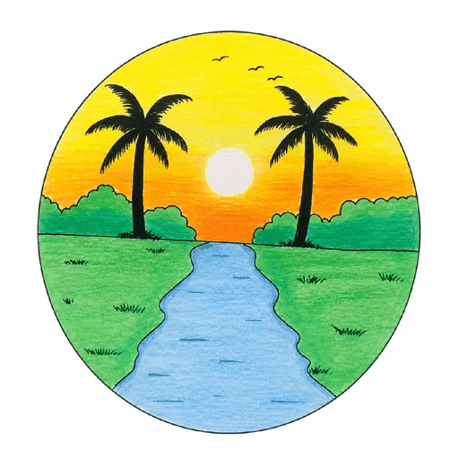

<!DOCTYPE html>
<html lang="ar" dir="rtl">
<head>
<meta charset="UTF-8">
<meta name="viewport" content="width=device-width, initial-scale=1.0">

<title>Alislamiah | الإسلامية</title>

</head>

<body>

<!-- ================= HEADER ================= -->

<header>

    <button class="menu-btn" onclick="openMenu()" aria-label="فتح القائمة">
        ☰
    </button>

    

</header>

<!-- ================= SIDE MENU ================= -->

<aside class="side-menu" id="sideMenu">

    <button class="close-btn" onclick="closeMenu()" aria-label="إغلاق">
        ×
    </button>

    <!-- المنصات -->

    

        
منصاتنا

        <a class="menu-link"
           href="https://youtube.com/@alislamiah5195?si=Xu0kvsc6jQliUWbc"
           target="_blank">
           ▶️ يوتيوب
        </a>

        <a class="menu-link"
           href="https://tiktok.com/@alislamiah5195"
           target="_blank">
           🎵 تيك توك
        </a>

        <a class="menu-link"
           href="https://www.instagram.com/alislamiahbusines?stkn=MWpiM2xwYW10b3Qybg=="
           target="_blank">
           📷 أنستاغرام
        </a>

        <a class="menu-link"
           href="https://www.facebook.com/share/1GfWQLXq5o/"
           target="_blank">
           📘 فايسبوك
        </a>

    

    <!-- الخدمات -->

    

        
خدماتنا

        <a class="menu-link"
           href="https://mohamedmadoui5195.github.io/Alislamiah-AI/ads.html">
           📢 حجز إعلانك
        </a>

        <a class="menu-link"
           href="https://mohamedmadoui5195.github.io/Alislamiah-search-console/">
           🔎 طلب فهرسة موقعك
        </a>

        <a class="menu-link"
           href="https://mohamedmadoui5195.github.io/Alislamiah-_net/">
           📚 المنصة التعليمية
        </a>

        <a class="menu-link"
           href="https://mohamedmadoui5195.github.io/Alislamiah-_net/comunucation.html">
           💬 تواصل معنا
        </a>

    

</aside>

<!-- ================= MAIN ================= -->

<main>

    <!-- HERO -->

    <section class="hero">

        

        <h1>
            مرحباً بك في
            Alislamiah
        </h1>

        

            شبكة رقمية متكاملة تقدم خدمات ومنصات رقمية متنوعة
            تجمع بين التعليم، التقنية، والمحتوى الهادف.
        

    </section>

    <!-- ABOUT -->

    <section class="about">

        <h2 class="section-title">
            عن Alislamiah
        </h2>

        

            

                الإسلامية هي شبكة رقمية توفر خدمات متعددة،
                منها منصة تعليمية متكاملة ومتصفح آمن خالٍ من الإباحات،
                بالإضافة إلى مجموعة من المنصات والخدمات الرقمية
                التي تهدف إلى توفير تجربة تقنية آمنة ومفيدة للمستخدمين.
            

        

    </section>

    <!-- SERVICES -->

    <section class="services">

        <h2 class="section-title">
            ماذا تقدم الإسلامية؟
        </h2>

        

            

                
📚

                <h3>منصة تعليمية</h3>
                

                    منصة تعليمية متكاملة للوصول إلى المحتوى
                    التعليمي والدروس بطريقة سهلة.
                

            

            

                
🌐

                <h3>تجربة تصفح آمنة</h3>
                

                    متصفح آمن يركز على توفير تجربة تصفح
                    خالية من المحتوى الإباحي.
                

            

            

                
🔎

                <h3>خدمات رقمية</h3>
                

                    مجموعة من الخدمات الرقمية مثل فهرسة المواقع
                    والإعلانات والتواصل.
                

            

        

    </section>

</main>

<!-- ================= GOTO BUTTON ================= -->

<a href="https://mohamedmadoui5195.github.io/Alislamiah-_net/"
   class="goto-button"
   id="gotoButton">
   الانتقال إلى Alislamiah
</a>

<!-- ================= FOOTER ================= -->

<footer>

    © Alislamiah
     
    الإسلامية دائماً الأفضل

</footer>

</body>
</html>

بعد وضع الكود، ضع "icon.png" في نفس مجلد ملف HTML حتى يظهر اللوجو بشكل صحيح.